# Hospital Management System — Entity-Relationship Diagram

## Mermaid ER Diagram

```mermaid
erDiagram
    %% ─────────────────────────────────────
    %%  CORE ENTITIES
    %% ─────────────────────────────────────

    users {
        int id PK
        string username UK "login credential"
        string email UK
        string hashed_password
        string full_name
        string role "admin | doctor | nurse | receptionist | staff | medical_desk"
        string phone_number
        bool is_active
        datetime created_at
        datetime updated_at
    }

    departments {
        int id PK
        string name UK
        string description
        string head_of_department
        string phone
        string email
        string floor
        datetime created_at
        datetime updated_at
    }

    doctors {
        int id PK
        string doctor_id UK "DOC-NNNN"
        string first_name
        string last_name
        string specialization
        string qualification
        int experience_years
        string phone
        string email
        string license_number UK
        int department_id FK
        int consultation_fee
        string available_days
        string available_hours
        bool is_active
        datetime created_at
        datetime updated_at
    }

    patients {
        int id PK
        string patient_id UK "OP-DDmmmYY"
        string first_name
        string last_name
        date date_of_birth
        enum gender "male | female | other"
        enum blood_group "A+ A- B+ B- AB+ AB- O+ O-"
        string phone
        string email
        text address
        string emergency_contact
        string emergency_phone
        text medical_history
        text allergies
        enum patient_form_type "general | maternity | other"
        date due_date "maternity EDD"
        date operation_due_date
        date next_visit_date
        date appointment_date
        enum payment_mode "cash | upi"
        decimal amount
        int age
        string guardian
        string aadhar_id
        text father_address
        text inlaws_address
        string qualification
        text obstetric_history
        date surgery_date_adjustment
        decimal weight
        decimal height
        string blood_pressure
        decimal temperature
        int pulse_rate
        decimal spo2
        datetime created_at
        datetime updated_at
    }

    patient_history {
        int id PK
        int patient_db_id FK "patients.id"
        string patient_id
        string changed_by "username"
        datetime recorded_at
        string first_name "snapshot"
        string last_name "snapshot"
        text all_patient_fields "full snapshot of patient row"
    }

    %% ─────────────────────────────────────
    %%  OUTPATIENT MODULE
    %% ─────────────────────────────────────

    appointments {
        int id PK
        string appointment_number UK
        int token_number "daily sequential"
        datetime token_date
        int patient_id FK "patients.id"
        string patient_str_id "display PAT-XXXX"
        int doctor_id FK "doctors.id"
        datetime appointment_date
        int duration_minutes
        enum status "scheduled | confirmed | in_progress | completed | cancelled | no_show"
        text reason
        text diagnosis
        text prescription
        text notes
        int is_new_patient "0 or 1"
        datetime created_at
        datetime updated_at
    }

    prescriptions {
        int id PK
        string prescription_id UK "RX-NNNN"
        int patient_db_id FK "patients.id"
        int doctor_db_id FK "users.id"
        text diagnosis
        text notes
        string follow_up_date
        text medicines_json "JSON array"
        datetime created_at
        datetime updated_at
    }

    %% ─────────────────────────────────────
    %%  INPATIENT MODULE
    %% ─────────────────────────────────────

    inpatients {
        int id PK
        string inpatient_id UK "IP-suffix mirrors OP-suffix"
        int patient_db_id FK "patients.id"
        string patient_id "denormalised OP-XXX"
        date admission_date
        text admission_diagnosis
        enum ward "general | maternity | icu | private | semi_private"
        string room_number
        string bed_number
        string attending_doctor
        text observations
        text treatment_given
        text diet_instructions
        text investigations
        string surgery_performed
        date surgery_date
        string anaesthesia_type
        date discharge_date
        text discharge_diagnosis
        text discharge_summary
        date follow_up_date
        enum status "admitted | discharged | transferred"
        text prescription_json "legacy JSON"
        text prescription_notes
        decimal room_charges
        decimal doctor_fees
        decimal medicine_charges
        decimal surgery_charges
        decimal lab_charges
        decimal nursing_charges
        decimal other_charges
        decimal total_amount
        decimal discount
        decimal net_amount
        decimal amount_paid
        decimal balance_due
        string payment_mode
        string payment_status "pending | partial | paid"
        datetime created_at
        datetime updated_at
    }

    inpatient_prescriptions {
        int id PK
        string ip_rx_id UK "IP-RX-NNNN"
        int inpatient_db_id FK "inpatients.id"
        string inpatient_id
        string prescribed_by
        text diagnosis
        text medicines_json "JSON [{name,dosage,frequency,duration,instructions}]"
        text notes
        datetime created_at
        datetime updated_at
    }

    inpatient_medicine_issues {
        int id PK
        string issue_id UK "IP-ISS-NNNN"
        int inpatient_prescription_id FK "inpatient_prescriptions.id"
        int inpatient_db_id FK "inpatients.id"
        string inpatient_id
        string issued_by "pharmacist"
        text medicines_json "actual issued medicines"
        text issue_notes
        datetime issued_at
    }

    inpatient_diagnostics {
        int id PK
        int inpatient_db_id FK "inpatients.id"
        string inpatient_id
        string test_name
        enum test_type "lab | scan | xray | blood | ecg | other"
        string ordered_by
        datetime ordered_at
        enum status "pending | in_progress | completed"
        text result_notes
        text report_text
        string completed_by
        datetime completed_at
        datetime created_at
        datetime updated_at
    }

    inpatient_activities {
        int id PK
        int inpatient_db_id FK "inpatients.id"
        string inpatient_id
        string activity_name
        enum activity_type "bp_check | sugar_check | injection | physiotherapy | nursing_care | dressing | walking | diet | other"
        string ordered_by
        datetime scheduled_at
        text notes
        enum status "pending | completed | skipped"
        string completed_by
        datetime completed_at
        text completion_notes
        datetime created_at
        datetime updated_at
    }

    inpatient_billing_items {
        int id PK
        int inpatient_db_id FK "inpatients.id"
        string inpatient_id
        enum category "room_charge | doctor_visit | medicine | surgery | lab | nursing | other"
        string description
        int quantity
        decimal unit_price
        decimal total_price
        datetime billing_date
        text notes
        string created_by
        string sale_ref_id "SALE-xxxx linkage"
        datetime created_at
        datetime updated_at
    }

    %% ─────────────────────────────────────
    %%  MEDICAL DESK / PHARMACY MODULE
    %% ─────────────────────────────────────

    medicines {
        int id PK
        string medicine_id UK "MED-NNNN"
        string name
        string category "tablets | syrup | injection"
        string manufacturer
        string batch_number
        string unit "tablets | ml | capsules"
        int stock_quantity
        int low_stock_threshold
        decimal price
        date expiry_date
        text notes
        datetime created_at
        datetime updated_at
    }

    medicine_sales {
        int id PK
        string sale_id UK "SALE-NNNN"
        int patient_db_id FK "patients.id"
        int medicine_db_id FK "medicines.id"
        int quantity_sold
        decimal unit_price
        decimal total_price "recalculated on return"
        string payment_mode "cash | upi"
        datetime sold_at
        bool is_inpatient
        string inpatient_id "IP-XXX if IP sale"
        string payment_status "paid | due | cleared | partial_return | full_return"
        decimal due_amount
        datetime cleared_at
        int quantity_returned
        decimal refund_amount
        string sold_by "staff name"
    }

    medicine_returns {
        int id PK
        string return_id UK "RET-NNNN"
        int sale_db_id FK "medicine_sales.id"
        string sale_id
        int medicine_db_id FK "medicines.id"
        int patient_db_id FK "patients.id"
        int quantity_returned
        decimal unit_price
        decimal refund_amount
        bool is_inpatient
        string inpatient_id
        text return_reason
        string returned_by "staff name"
        datetime created_at
    }

    %% ─────────────────────────────────────
    %%  FINANCE & AUDIT MODULE
    %% ─────────────────────────────────────

    expenses {
        int id PK
        string expense_id UK "EXP-NNNN"
        enum category "salary | utilities | rent | supplies | maintenance | equipment | insurance | other"
        text description
        decimal amount
        string paid_to
        string payment_mode
        date expense_date
        int created_by FK "users.id"
        datetime created_at
    }

    audit_logs {
        int id PK
        int user_id FK "users.id"
        string action "CREATE | UPDATE | DELETE | RETURN"
        string table_name
        string record_id
        text old_values "JSON"
        text new_values "JSON"
        datetime timestamp
        string ip_address
        string user_agent
    }

    %% ─────────────────────────────────────
    %%  RELATIONSHIPS
    %% ─────────────────────────────────────

    departments ||--o{ doctors : "has doctors"
    doctors ||--o{ appointments : "attends"
    patients ||--o{ appointments : "books"
    patients ||--o{ patient_history : "edit snapshots"
    patients ||--o{ prescriptions : "receives"
    users ||--o{ prescriptions : "doctor writes"
    users ||--o{ audit_logs : "performs"
    users ||--o{ expenses : "creates"

    patients ||--o{ inpatients : "admitted as"
    inpatients ||--o{ inpatient_prescriptions : "prescribed"
    inpatient_prescriptions ||--o{ inpatient_medicine_issues : "dispensed via"
    inpatients ||--o{ inpatient_diagnostics : "tests ordered"
    inpatients ||--o{ inpatient_activities : "care activities"
    inpatients ||--o{ inpatient_billing_items : "billed"

    patients ||--o{ medicine_sales : "purchases"
    medicines ||--o{ medicine_sales : "sold"
    medicine_sales ||--o{ medicine_returns : "returned from"
    medicines ||--o{ medicine_returns : "stock restored"
    patients ||--o{ medicine_returns : "returned by"

    medicine_sales ||--o| inpatient_billing_items : "auto-creates via sale_ref_id"
```

---

## Textual Description

### 1. Core Entities

| Entity | Purpose | Key ID Format |
|--------|---------|---------------|
| **users** | Authentication & role-based access (admin, doctor, staff, medical_desk) | Auto-increment |
| **departments** | Hospital departments (Gynecology, Pediatrics, etc.) | Auto-increment |
| **doctors** | Doctor profiles linked to departments | DOC-NNNN |
| **patients** | Outpatient registration with vitals, demographics, maternity fields | OP-DDmmmYY |

### 2. Outpatient Module

| Entity | Purpose | Key ID Format |
|--------|---------|---------------|
| **patient_history** | Immutable snapshots saved on every patient edit (audit trail) | Auto-increment |
| **appointments** | Token-based daily scheduling with status lifecycle | APT-NNNN |
| **prescriptions** | Doctor-created prescriptions with medicines JSON | RX-NNNN |

### 3. Inpatient Module

| Entity | Purpose | Key ID Format |
|--------|---------|---------------|
| **inpatients** | Admission records derived from OP patient (OP-XXX → IP-XXX) | IP-suffix |
| **inpatient_prescriptions** | IP medicine prescriptions (inventory-backed dropdown) | IP-RX-NNNN |
| **inpatient_medicine_issues** | Pharmacy dispensing records linked to IP prescriptions | IP-ISS-NNNN |
| **inpatient_diagnostics** | Lab/scan/ECG orders with status workflow | Auto-increment |
| **inpatient_activities** | Nursing tasks (BP check, injection, dressing, etc.) | Auto-increment |
| **inpatient_billing_items** | Line-item billing by category (room, medicine, surgery, lab) | Auto-increment |

### 4. Medical Desk / Pharmacy Module

| Entity | Purpose | Key ID Format |
|--------|---------|---------------|
| **medicines** | Inventory with stock tracking, expiry, low-stock alerts | MED-NNNN |
| **medicine_sales** | Sale transactions with inpatient linkage, due tracking, return tracking | SALE-NNNN |
| **medicine_returns** | Return audit records with anti-fraud validation | RET-NNNN |

### 5. Finance & Audit Module

| Entity | Purpose | Key ID Format |
|--------|---------|---------------|
| **expenses** | Hospital expenses by category (salary, rent, supplies, etc.) | EXP-NNNN |
| **audit_logs** | Immutable audit trail for all CRUD + RETURN operations | Auto-increment |

---

## Key Relationships & Business Rules

1. **Patient → Inpatient (1:N)**: One OP patient can have multiple IP admissions. IP ID mirrors OP suffix.
2. **Inpatient → IP Prescription → Medicine Issue**: Doctor prescribes → Medical Desk dispenses → billing auto-created.
3. **Medicine Sale → Billing Item**: When dispensing for an inpatient, `sell_medicine` auto-creates an `InpatientBillingItem` with `sale_ref_id` linkage.
4. **Medicine Sale → Return**: Returns restore stock, recalculate `total_price`, update `payment_status`, and adjust billing items. Anti-fraud: cannot return more than sold − already_returned.
5. **Patient Edit → History Snapshot**: Every update to a patient record creates a full snapshot in `patient_history` for audit compliance.
6. **Audit Log**: All return transactions are logged in `audit_logs` with old/new value JSON for regulatory compliance.
